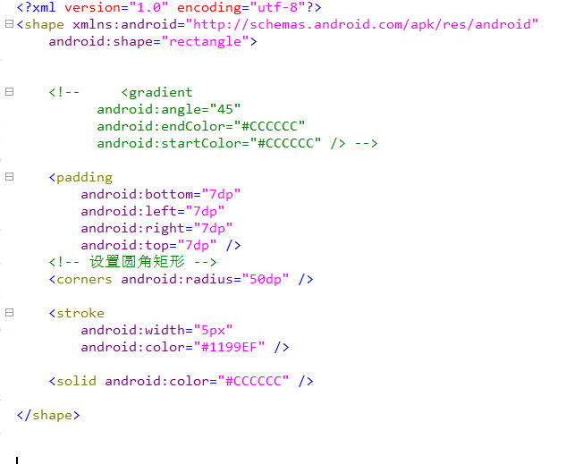
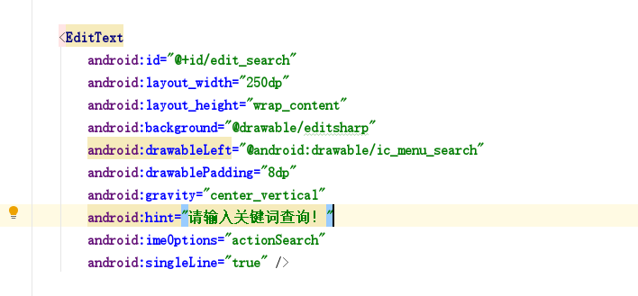
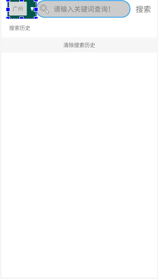

Query

搜索框布局设置

Android 利用 Shape 样式设置文本框 EditText 圆角形状

1.首先新建样式文件 ，命名为（根据自己习惯）： editsharp.xml

2.在布局文件中引用样式文件：

在哪引用： Android：background = “@drawable/editsharp”

调节 radius 的大小，就可以设置搜索框是否半圆等形状

完成的展示：

